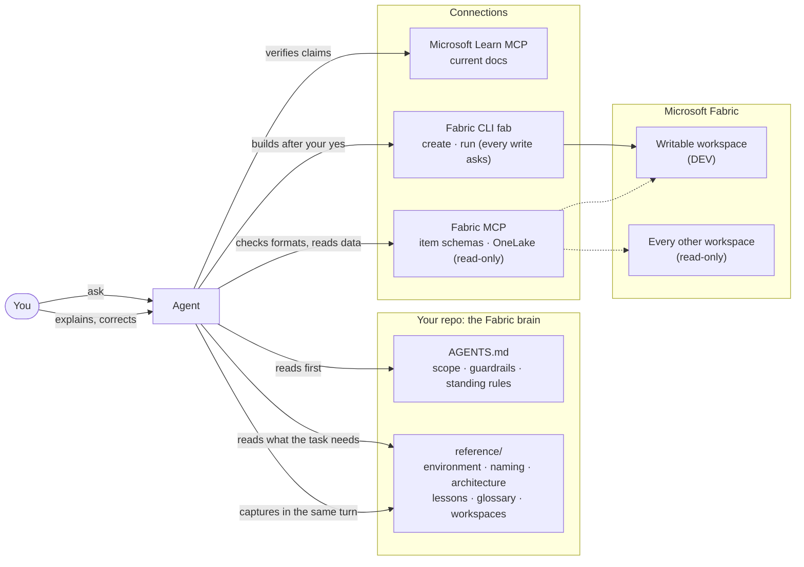

#  Fabric Engineering Skills

[](./CHANGELOG.md)
[](./LICENSE)
[](https://github.com/DKSang/fabric-engineering-skills/actions/workflows/check.yml)
[](#install)
[](#install)

> **Preview.** Five skills, checked against Fabric CLI 1.7 and Fabric MCP 1.4, and tested with headless Claude Code runs against a simulated `fab`. Not yet run end to end against a live tenant. [See what's tested.](#feature-stability)

**Agent skills that give your AI a second brain for Microsoft Fabric.** [Tiếng Việt](./README.vi.md)

Turn any repo into a **Fabric brain**: an `AGENTS.md` and a `reference/` folder that your AI reads at the start of every session, connected to live Fabric through the Fabric CLI and MCP servers. It already knows your workspaces, your naming conventions, your medallion architecture and the latest Fabric features, so you never explain yourself twice.

```
/plugin marketplace add DKSang/fabric-engineering-skills
/plugin install fabric-engineering-skills@fabric-engineering
/setup-fabric-engineering-skills

> Set up my metadata-driven bronze layer for the orders data in my dev workspace
```

Works with Claude Code, DeepSeek Harness (`dsh`), Codex, GitHub Copilot, Cursor and Gemini CLI. The knowledge lives in plain files, not inside any one tool, so it comes with you when you switch.

## The Problem

The bottleneck for AI-assisted Fabric development isn't model intelligence anymore. It's **context**. A fresh session doesn't know:

- your workspace structure, or which workspace it's allowed to touch
- your naming conventions and your medallion or metadata-driven patterns
- what your team decided last month, or the gotcha you hit last week
- Fabric features that shipped after its training cutoff (so it guesses, confidently)

So you explain, correct, finally get a good answer, close the chat, and tomorrow you onboard the same consultant from zero.

**Fabric Engineering Skills gives the agent an onboarding package that keeps itself up to date.**

## Quick Start

### Install

Pick **one** route; installing both gives you every skill twice.

**Claude Code (recommended)**: a managed plugin that updates when a new version ships.

```bash
claude plugin marketplace add DKSang/fabric-engineering-skills
claude plugin install fabric-engineering-skills@fabric-engineering
```

**DeepSeek Harness (`dsh`), Codex, GitHub Copilot, Cursor and other agents**: copies the skill folders into your project as files you own.

```bash
npx skills@latest add DKSang/fabric-engineering-skills
```

More options (team install, manual copy, update, uninstall): [Install](#install).

### Set up the brain

In the repo you want to turn into a Fabric brain:

```
/setup-fabric-engineering-skills
```

It explores the repo and your machine, asks a few questions one at a time (which AI tools to configure, defaulting to only the one you're running; which workspace the agent may modify; sign-in identity; your conventions), shows you a draft of every file, then writes, installs the Fabric CLI and MCP servers, and **hands sign-in to you**: you run `fab auth login` and `az login` in your own terminal, so the agent never sees a secret. Restart the agent, then:

```
/setup-fabric-engineering-skills verify
```

Every check is read-only and ends in one table:

```
| Check                        | Result | Detail                                              |
| ---------------------------- | ------ | --------------------------------------------------- |
| C2 Signed in                 | pass   | dev@contoso.com, tenant 1234...                     |
| C4 Sales-DEV exists          | pass   |                                                     |
| A3 Same tenant for fab / az  | fail   | fab 1234..., az 9876... → az login --tenant 1234... |
| M2 Microsoft Learn MCP       | pass   | microsoft_docs_search returned results              |
| M4 Fabric MCP reaches tenant | pass   | onelake_list-workspaces lists Sales-DEV             |
```

### Build

Ask for Fabric work without restating a single convention:

> Set up my bronze layer for the orders data in Sales-DEV.

`build-in-fabric` loads your conventions, checks current item formats on Fabric MCP and behaviour on Microsoft Learn, and stops at a dry-run plan for your yes:

```
Plan: bronze layer for orders (source webshop) in Sales-DEV
Route: direct (definitions in fabric/Sales-DEV/, imported with fab)

| # | Action | Item / path                                  | How                             |
| - | ------ | -------------------------------------------- | ------------------------------- |
| 1 | create | lh_landing.Lakehouse                         | fab mkdir                       |
| 2 | create | lh_config.Lakehouse                          | fab mkdir                       |
| 3 | create | lh_bronze.Lakehouse (schemas on)             | fab mkdir -P enableSchemas=true |
| 4 | upload | lh_landing/Files/webshop/orders.csv          | fab cp from data/orders.csv     |
| 5 | upload | lh_config/Files/webshop/webshop.json         | fab cp                          |
| 6 | create | nb_load_bronze.Notebook                      | fab import                      |
| 7 | create | pl_ingest_bronze_webshop.DataPipeline        | fab import (needs step 6's ID)  |

Won't touch: anything else in Sales-DEV; Sales-PRD is never touched.
Conventions applied: naming-conventions.md, architecture/medallion-bronze.md
```

After the build it verifies each item and offers an **end-to-end test**: run the pipeline, check the data (not just the run status), and on failure diagnose, fix and re-run. Anything non-obvious it learned lands in `reference/lessons.md`.

### Document a workspace

```
/document-fabric-workspace Sales-DEV
```

Writes `reference/workspaces/Sales-DEV.md` (items, table schemas, what each notebook and pipeline does, lineage). Re-runs are **incremental**: a state file of item IDs, repo definition hashes and table timestamps means only what changed gets read.

| Run | fab calls | Result |
| --- | --- | --- |
| First | 11 (incl. 2 exports) | full document |
| Nothing changed | 6 listings, 0 exports, 0 schemas | "Nothing changed", file untouched |
| Rename + new table + written table | + 2 schema reads, no re-export | only the affected sections edited |

### Close the session

```
/fabric-retro
```

Sweeps the session for what slipped past: corrections, lessons, facts you mentioned in passing, lines in `reference/` this session made stale. Proposes each with its evidence; applies only what you pick.

## How It Works

A Fabric brain has four pieces:

| Piece | Files | Job |
| --- | --- | --- |
| **Instruction file** | `AGENTS.md` (read natively by dsh and Codex) + one-line pointers for the tools that need one (`CLAUDE.md`, `.github/copilot-instructions.md`, `GEMINI.md`, `.cursor/rules/agents.mdc`) | How the agent behaves: scope, guardrails, standing rules, where the knowledge is |
| **Reference files** | `reference/`: environment, naming conventions, architecture patterns, lessons, glossary, decisions, workspace inventories | What you know |
| **Connections** | Fabric CLI `fab`; Microsoft Learn MCP and Fabric MCP (required), more optional | Live information and the ability to build and run things |
| **Workflows** | the skills in this repo | What you repeat all the time |



### How the skills fit together

| Stage | Skill | What happens |
| --- | --- | --- |
| Once per repo | `/setup-fabric-engineering-skills` | You pick which AI tools to configure; it writes `AGENTS.md`, their pointers and MCP config, and `reference/` seeds; installs the Fabric CLI and MCP servers; you sign in; read-only verification |
| After a restart, any time | `/setup-fabric-engineering-skills verify` | Re-checks sign-in, tenant, workspaces and every MCP server |
| Every task | `fabric-brain` (automatic) | Reads the relevant `reference/` files first; flags requests that contradict them; captures what you explain or correct |
| Building | `build-in-fabric` (automatic) | Plan → dry run → your yes → build in the writable workspace → verify → end-to-end test → fix and re-run |
| After changes in Fabric | `/document-fabric-workspace <ws>` | Updates the workspace inventory; reads only what changed |
| End of session | `/fabric-retro` | Proposes what the brain should keep; applies what you pick |

## Skills Reference

| Skill | Invoked by | Arguments | Description |
| --- | --- | --- | --- |
| **[setup-fabric-engineering-skills](./skills/setup/setup-fabric-engineering-skills/SKILL.md)** | you | `[verify]` | Turn this repo into a Fabric brain: write `AGENTS.md` and pointer files, seed `reference/`, install the Fabric CLI and MCP servers, walk you through sign-in, then verify every connection. Run once per repo; `verify` re-checks any time. |
| **[fabric-brain](./skills/brain/fabric-brain/SKILL.md)** | the agent (or you) | | Read the relevant `reference/` files before Fabric work, and record every durable fact you explain or correct (conventions, environment facts, gotchas, business terms) in the right file, in the same turn. Owns the layout and formats of `reference/`. |
| **[document-fabric-workspace](./skills/brain/document-fabric-workspace/SKILL.md)** | you | `<workspace> [--full] [items...]` | Inventory a workspace into `reference/workspaces/<ws>.md`: items, tables and schemas, what each notebook and pipeline does, and the lineage between them. Incremental and read-only against Fabric. |
| **[fabric-retro](./skills/brain/fabric-retro/SKILL.md)** | you | | End-of-session sweep for corrections, lessons, uncaptured facts and stale lines. Proposes each change with its evidence; applies only what you pick. |
| **[build-in-fabric](./skills/build/build-in-fabric/SKILL.md)** | the agent (or you) | | Plan from your conventions, dry run for your yes, build only in the writable workspace (directly with `fab`, or as definitions in your Git-connected repo), verify, then end-to-end test with diagnose, fix and re-run. |

Skills "invoked by you" run only when you type them. Skills the agent invokes are also picked up on their own when the task fits.

## What the Setup Writes

```
your-repo/
├── AGENTS.md                         ← canonical instructions (scope, guardrails, standing rules, index)
├── CLAUDE.md                         ← pointer: @AGENTS.md (if you picked Claude Code)
├── .github/copilot-instructions.md   ← pointer (if you picked Copilot)
├── GEMINI.md                         ← pointer (if you picked Gemini CLI)
├── .mcp.json                         ← Microsoft Learn MCP + Fabric MCP (Claude Code)
├── .dsh/fabric-engineering.cordis.yml ← the same two servers for dsh (if you picked dsh)
├── .claude/settings.json             ← fab read commands allowed, write commands always ask (Claude Code)
├── reference/
│   ├── environment.md                ← tenant, workspaces, what's in scope
│   ├── naming-conventions.md
│   ├── fabric-cli.md
│   ├── architecture/                 ← one file per pattern you use
│   ├── lessons.md                    ← created when there's a first lesson
│   └── workspaces/                   ← created by /document-fabric-workspace
└── data/                             ← sample files for development
```

Only the tools you pick get their files; `AGENTS.md` and `reference/` are always written. It merges into files you already have and never overwrites your content: everything it owns sits between `<!-- fabric-engineering-skills:start -->` and `<!-- fabric-engineering-skills:end -->` markers. Changes to `reference/` are left uncommitted so you review them in the diff like any other change.

## Connections

| Server | Required? | Gives the agent | Auth |
| --- | --- | --- | --- |
| Microsoft Learn MCP | **yes** | Current Microsoft docs and code samples; powers the standing rule "verify Fabric claims before stating them" | none |
| Fabric MCP (`@microsoft/fabric-mcp`) | **yes** | Item definition schemas, API specs, best practices (offline); OneLake files and tables (live). Runs `--read-only` by default, so every change goes through `fab` | Azure CLI sign-in |
| Microsoft remote Fabric MCPs | optional | FabricIQ, Power BI modeling, SQL endpoint queries (via Microsoft's [skills-for-fabric](https://github.com/microsoft/skills-for-fabric) plugin) | Azure CLI sign-in |
| Fabric RTI MCP | optional | Eventhouse / KQL | Azure sign-in |

## Authentication

You sign in yourself; the skills never handle a password or secret.

```bash
# Fabric CLI: interactive user, service principal or managed identity (menu)
fab auth login

# Fabric MCP and the remote MCPs: same identity, same tenant
az login
az login --tenant <tenant-id> --allow-no-subscriptions   # tenant without an Azure subscription
```

Prefer a **service principal** with access to only your dev workspace. With your own account, the agent can see everything you can; if you're a Fabric admin, use a playground tenant.

## Safety

- **Scope.** `AGENTS.md` names the workspaces the agent may modify; every other workspace is read-only, and production is never modified.
- **Every write asks.** Read-only `fab` commands run freely; anything that can change Fabric hits a permission prompt, and `build-in-fabric` won't start without your yes to its plan.
- **Destructive operations need their own yes.** Git restores **definitions** (notebooks, pipelines, item settings), not **data**: files in a lakehouse, Delta tables and items deleted with `--hard` don't come back from Git.
- **Safest workflow.** Let the agent edit item definitions in a Git-connected repo, and sync them to Fabric yourself.

## Install

**Requirements**: an AI coding tool and Git. The setup skill installs the rest (Python 3.10 to 3.13 for the Fabric CLI, Node.js LTS and the Azure CLI for Fabric MCP) or gives you the exact command for your OS.

<details open>
<summary><strong>Claude Code: plugin</strong></summary>

From a terminal:

```bash
claude plugin marketplace add DKSang/fabric-engineering-skills
claude plugin install fabric-engineering-skills@fabric-engineering
```

Or inside a session: `/plugin marketplace add DKSang/fabric-engineering-skills`, then `/plugin install fabric-engineering-skills@fabric-engineering`.

**For a whole team**, add `--scope project` to both commands and commit `.claude/settings.json`: everyone who opens the repo is offered the plugin.

Skills are namespaced by the plugin: `/setup-fabric-engineering-skills` works, and so does `/fabric-engineering-skills:setup-fabric-engineering-skills` if another skill has the same name.

</details>

<details>
<summary><strong>DeepSeek Harness, Codex, GitHub Copilot, Cursor and other agents: <code>npx skills</code></strong></summary>

```bash
npx skills@latest add DKSang/fabric-engineering-skills
```

The installer asks which skills and which agents. Non-interactive, all skills, chosen agents:

```bash
npx skills@latest add DKSang/fabric-engineering-skills --skill '*' --agent codex github-copilot cursor -y
```

Add `-g` to install for your user instead of this project.

For **DeepSeek Harness (`dsh`)**, use `--agent universal`: it installs into `.agents/skills/`, which dsh discovers. The setup then writes dsh's MCP servers to `.dsh/fabric-engineering.cordis.yml`; launch with `dsh web --patch "$PWD/.dsh/fabric-engineering.cordis.yml"` (or let the setup merge it into `~/.dsh/cordis.patch.yml`).

</details>

<details>
<summary><strong>Manual</strong></summary>

Clone the repo and copy (or symlink) each folder under `skills/*/` that contains a `SKILL.md` into your agent's skills folder: `.claude/skills/` for Claude Code, `.agents/skills/` for Codex and other Agent Skills-compatible tools. Keep each folder whole: some skills ship files and scripts next to their `SKILL.md`.

</details>

<details>
<summary><strong>Update, uninstall</strong></summary>

| Route | Update | Uninstall |
| --- | --- | --- |
| Claude Code plugin | `claude plugin marketplace update fabric-engineering` then `claude plugin update fabric-engineering-skills@fabric-engineering`, or enable auto-update in `/plugin` → Marketplaces | `claude plugin uninstall fabric-engineering-skills@fabric-engineering` |
| `npx skills` | `npx skills update` | `npx skills remove` |
| Manual | `git pull` in your clone (symlinks pick it up) | delete the folders |

Uninstalling the skills leaves everything they wrote in your repo (`AGENTS.md`, `reference/`, MCP config) in place: that's your Fabric brain, and it keeps working without the skills.

</details>

**Check the install**: start a new session and type `/setup-fabric-engineering-skills`. If the command isn't offered, restart the tool; for the plugin route, `claude plugin list` should show `fabric-engineering-skills` as enabled.

## Architecture

```
fabric-engineering-skills/
├── .claude-plugin/
│   ├── plugin.json                 # Claude Code plugin manifest (version, skills)
│   └── marketplace.json            # the repo is its own single-plugin marketplace
├── skills/
│   ├── setup/
│   │   └── setup-fabric-engineering-skills/
│   │       ├── SKILL.md            # explore → ask → confirm → write → install → sign-in → verify
│   │       ├── AGENTS-TEMPLATE.md  # the AGENTS.md block it writes
│   │       ├── POINTERS.md         # CLAUDE.md, Copilot, Gemini, Cursor pointers
│   │       ├── MCP-SERVERS.md      # per-tool MCP config (Learn, Fabric MCP, optional servers)
│   │       ├── FABRIC-CLI.md       # install, identity, sign-in, permission rules
│   │       └── VERIFY.md           # read-only checks and troubleshooting
│   ├── brain/
│   │   ├── fabric-brain/           # capture discipline + formats for every reference/ file
│   │   ├── document-fabric-workspace/
│   │   │   └── scripts/workspace_state.py   # incremental change detection (only runs fab ls)
│   │   └── fabric-retro/
│   └── build/
│       └── build-in-fabric/        # plan-build-verify-test loop, fab recipes, e2e test guide
├── scripts/                        # check-skills.sh (repo invariants), link-skills.sh
└── tests/                          # unit tests for workspace_state.py
```

Each skill is a folder with a `SKILL.md`, an `agents/openai.yaml` for Codex, and the reference files it owns.

## Contributing

Contributions welcome. Maintainer conventions live in [.claude/CLAUDE.md](./.claude/CLAUDE.md), shared vocabulary in [CONTEXT.md](./CONTEXT.md).

```bash
git clone https://github.com/DKSang/fabric-engineering-skills.git
cd fabric-engineering-skills
scripts/check-skills.sh                      # repo invariants
python -m unittest discover -s tests         # script tests
claude plugin validate . --strict            # manifests
scripts/link-skills.sh                       # symlink skills into ~/.claude/skills and ~/.agents/skills
```

Every `fab` command written in a skill must match the current CLI (`fab <command> --help`), and skills never handle a user's secret.

## Feature Stability

| Feature | Status | Notes |
| --- | --- | --- |
| Plugin and `npx skills` install | **Tested** | Both routes installed from GitHub; bare and namespaced slash commands resolve |
| Setup: files, pointers, MCP config, permission rules | **Tested** | Formats and JSON validated; merge behaviour covered in the skill |
| Setup: choose which AI tools to configure | **Tested** | Defaults to the tool running the setup; others only when picked |
| DeepSeek Harness (`dsh`) | **Checked** | The MCP overlay boots in dsh 2026-09 (rows validate, Fabric MCP starts); `AGENTS.md` loading, skills folders and `/skill` invocation confirmed in dsh's source; not yet run with a model |
| Setup: `fab` and Fabric MCP commands | **Checked** | Against Fabric CLI 1.7 help/source and Fabric MCP 1.4 (`--read-only` tool list verified) |
| `fabric-brain` capture and conflict detection | **Tested** | Headless Claude Code runs |
| `build-in-fabric` gates (scope, sign-in, undocumented pattern, dry-run plan) | **Tested** | Headless runs with a simulated `fab`; no writes issued |
| `build-in-fabric` build, verify, end-to-end test | **Not yet live** | Recipes checked against the CLI; not run against a real tenant |
| `document-fabric-workspace` incremental runs | **Tested** | 10 unit tests + headless runs with a simulated `fab` |
| `fabric-retro` | **Tested** | Headless run: proposes with evidence, writes nothing unasked |
| Full loop on a live tenant | **Not yet** | Setup → verify → build → test → document → retro. Reports welcome |

## Related

- [microsoft/skills-for-fabric](https://github.com/microsoft/skills-for-fabric): Microsoft's workload skills (Spark, SQL, KQL, semantic models, ...). Complementary: this repo sets up *your* context; theirs teaches the workloads. The setup can install their plugin for you.
- [Fabric CLI](https://aka.ms/fabric-cli), [Microsoft Learn MCP](https://github.com/MicrosoftDocs/mcp), [Fabric MCP server](https://github.com/microsoft/mcp/tree/main/servers/Fabric.Mcp.Server)
- Inspired by Aleksi Partanen's [My AI Setup for Microsoft Fabric: Never Explain Yourself Twice](https://youtu.be/5-sXBbBJbAk); structured after [mattpocock/skills](https://github.com/mattpocock/skills); README layout after [fabric-automation-bundles](https://github.com/dereknguyenio/fabric-automation-bundles).

## License

MIT. See [LICENSE](./LICENSE). Release notes: [CHANGELOG.md](./CHANGELOG.md).

Microsoft Fabric and the Fabric icon are trademarks of Microsoft. This is a community project, not affiliated with or endorsed by Microsoft.
