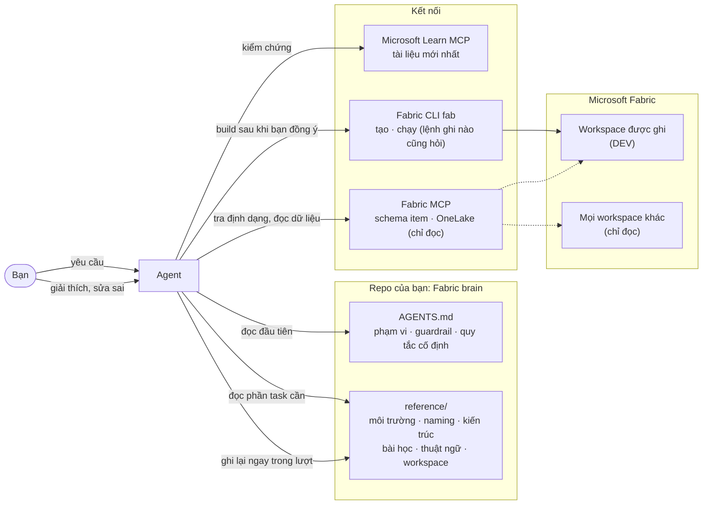

#  Fabric Engineering Skills

[](./CHANGELOG.md)
[](./LICENSE)
[](https://github.com/DKSang/fabric-engineering-skills/actions/workflows/check.yml)
[](#cài-đặt)
[](#cài-đặt)

> **Preview.** Năm skill, đã kiểm tra với Fabric CLI 1.7 và Fabric MCP 1.4, và test bằng Claude Code headless với một `fab` giả lập. Chưa chạy trọn vẹn trên tenant thật. [Xem những gì đã test.](#mức-độ-ổn-định)

**Bộ agent skill cho AI một "bộ não thứ hai" về Microsoft Fabric.** [English](./README.md)

Biến bất kỳ repo nào thành một **Fabric brain**: một file `AGENTS.md` và một folder `reference/` mà AI đọc ở đầu mỗi phiên, kết nối với Fabric thật qua Fabric CLI và các MCP server. AI đã biết sẵn workspace, naming convention, kiến trúc medallion của bạn và các tính năng Fabric mới nhất, nên bạn không bao giờ phải giải thích lại lần thứ hai.

```
/plugin marketplace add DKSang/fabric-engineering-skills
/plugin install fabric-engineering-skills@fabric-engineering
/setup-fabric-engineering-skills

> Set up my metadata-driven bronze layer for the orders data in my dev workspace
```

Dùng được với Claude Code, DeepSeek Harness (`dsh`), Codex, GitHub Copilot, Cursor và Gemini CLI. Kiến thức nằm trong file thường, không nằm trong tool nào, nên đổi tool vẫn mang theo được.

## Vấn đề

Điểm nghẽn khi dùng AI phát triển trên Fabric không còn là độ thông minh của model, mà là **context**. Một phiên mới không biết:

- cấu trúc workspace của bạn, hay workspace nào nó được phép đụng vào
- naming convention và pattern medallion / metadata-driven của bạn
- quyết định team đưa ra tháng trước, hay lỗi bạn gặp tuần trước
- các tính năng Fabric ra sau thời điểm model được huấn luyện (nên nó đoán, và đoán rất tự tin)

Thế là bạn giải thích, sửa, cuối cùng có câu trả lời tốt, đóng chat, và ngày mai lại onboard cùng một consultant từ con số không.

**Fabric Engineering Skills cho agent một bộ tài liệu onboarding tự cập nhật.**

## Bắt đầu nhanh

### Cài đặt

Chọn **một** cách; cài cả hai thì mỗi skill bị trùng hai lần.

**Claude Code (khuyên dùng)**: plugin tự cập nhật khi có bản mới.

```bash
claude plugin marketplace add DKSang/fabric-engineering-skills
claude plugin install fabric-engineering-skills@fabric-engineering
```

**DeepSeek Harness (`dsh`), Codex, GitHub Copilot, Cursor và agent khác**: copy các folder skill vào project thành file của bạn.

```bash
npx skills@latest add DKSang/fabric-engineering-skills
```

Thêm tuỳ chọn (cài cho cả team, cài thủ công, cập nhật, gỡ): [Cài đặt](#cài-đặt).

### Dựng bộ não

Trong repo bạn muốn biến thành Fabric brain:

```
/setup-fabric-engineering-skills
```

Skill khám phá repo và máy, hỏi lần lượt vài câu (cấu hình cho AI tool nào, mặc định chỉ tool bạn đang chạy; workspace agent được sửa; identity đăng nhập; convention của bạn), cho xem bản nháp mọi file, rồi ghi, cài Fabric CLI và MCP server, và **giao việc đăng nhập cho bạn**: bạn tự chạy `fab auth login` và `az login` trong terminal, agent không bao giờ thấy secret. Khởi động lại agent rồi chạy:

```
/setup-fabric-engineering-skills verify
```

Mọi bước kiểm tra đều chỉ đọc, kết quả là một bảng:

```
| Check                        | Result | Detail                                              |
| ---------------------------- | ------ | --------------------------------------------------- |
| C2 Signed in                 | pass   | dev@contoso.com, tenant 1234...                     |
| C4 Sales-DEV exists          | pass   |                                                     |
| A3 Same tenant for fab / az  | fail   | fab 1234..., az 9876... → az login --tenant 1234... |
| M2 Microsoft Learn MCP       | pass   | microsoft_docs_search returned results              |
| M4 Fabric MCP reaches tenant | pass   | onelake_list-workspaces lists Sales-DEV             |
```

### Build

Yêu cầu việc Fabric mà không cần nhắc lại convention nào:

> Set up my bronze layer for the orders data in Sales-DEV.

`build-in-fabric` đọc convention của bạn, tra định dạng item trên Fabric MCP và hành vi trên Microsoft Learn, rồi dừng ở kế hoạch dry-run chờ bạn đồng ý:

```
Plan: bronze layer for orders (source webshop) in Sales-DEV
Route: direct (definitions in fabric/Sales-DEV/, imported with fab)

| # | Action | Item / path                                  | How                             |
| - | ------ | -------------------------------------------- | ------------------------------- |
| 1 | create | lh_landing.Lakehouse                         | fab mkdir                       |
| 2 | create | lh_config.Lakehouse                          | fab mkdir                       |
| 3 | create | lh_bronze.Lakehouse (schemas on)             | fab mkdir -P enableSchemas=true |
| 4 | upload | lh_landing/Files/webshop/orders.csv          | fab cp from data/orders.csv     |
| 5 | upload | lh_config/Files/webshop/webshop.json         | fab cp                          |
| 6 | create | nb_load_bronze.Notebook                      | fab import                      |
| 7 | create | pl_ingest_bronze_webshop.DataPipeline        | fab import (needs step 6's ID)  |

Won't touch: anything else in Sales-DEV; Sales-PRD is never touched.
Conventions applied: naming-conventions.md, architecture/medallion-bronze.md
```

Build xong, nó xác minh từng item và đề xuất **test end-to-end**: chạy pipeline, kiểm tra dữ liệu (không chỉ trạng thái run), nếu lỗi thì tìm nguyên nhân, sửa và chạy lại. Điều gì không hiển nhiên mà nó học được sẽ vào `reference/lessons.md`.

### Lập danh mục workspace

```
/document-fabric-workspace Sales-DEV
```

Ghi `reference/workspaces/Sales-DEV.md` (item, schema bảng, notebook và pipeline làm gì, lineage). Lần chạy sau là **quét tăng dần**: file state lưu ID item, hash definition trong repo và thời điểm sửa bảng, nên chỉ đọc cái đã đổi.

| Lần chạy | Lệnh fab | Kết quả |
| --- | --- | --- |
| Đầu tiên | 11 (gồm 2 lần export) | ghi toàn bộ |
| Không có gì đổi | 6 lệnh liệt kê, 0 export, 0 schema | "Nothing changed", file giữ nguyên |
| Đổi tên + bảng mới + bảng được ghi | thêm 2 lần đọc schema, không export lại | chỉ sửa các section liên quan |

### Đóng phiên

```
/fabric-retro
```

Rà lại phiên xem có gì bị lọt: lời sửa sai, bài học, điều bạn nói lướt qua, dòng trong `reference/` mà phiên này làm cho sai. Đề xuất từng mục kèm bằng chứng; chỉ áp dụng cái bạn chọn.

## Cách hoạt động

Một Fabric brain có bốn phần:

| Phần | File | Vai trò |
| --- | --- | --- |
| **File chỉ dẫn** | `AGENTS.md` (dsh và Codex đọc trực tiếp) + file trỏ một dòng cho tool cần (`CLAUDE.md`, `.github/copilot-instructions.md`, `GEMINI.md`, `.cursor/rules/agents.mdc`) | Cách agent hành xử: phạm vi, guardrail, quy tắc cố định, kiến thức nằm ở đâu |
| **File tham chiếu** | `reference/`: môi trường, naming convention, pattern kiến trúc, bài học, thuật ngữ, quyết định, danh mục workspace | Những gì bạn biết |
| **Kết nối** | Fabric CLI `fab`; Microsoft Learn MCP và Fabric MCP (bắt buộc), thêm tuỳ chọn | Thông tin sống, và khả năng tạo và chạy item |
| **Workflow** | các skill trong repo này | Những việc bạn lặp lại hằng ngày |



### Các skill ăn khớp với nhau thế nào

| Giai đoạn | Skill | Điều gì xảy ra |
| --- | --- | --- |
| Một lần mỗi repo | `/setup-fabric-engineering-skills` | Bạn chọn AI tool cần cấu hình; skill ghi `AGENTS.md`, file trỏ và cấu hình MCP cho các tool đó, và `reference/`; cài Fabric CLI và MCP server; bạn đăng nhập; xác minh chỉ đọc |
| Sau khi khởi động lại, bất cứ lúc nào | `/setup-fabric-engineering-skills verify` | Kiểm tra lại đăng nhập, tenant, workspace và từng MCP server |
| Mọi task | `fabric-brain` (tự động) | Đọc file `reference/` liên quan trước; cảnh báo yêu cầu mâu thuẫn; ghi lại điều bạn giải thích hoặc sửa |
| Khi build | `build-in-fabric` (tự động) | Kế hoạch → dry run → bạn đồng ý → build trong workspace được ghi → xác minh → test end-to-end → sửa và chạy lại |
| Sau thay đổi trong Fabric | `/document-fabric-workspace <ws>` | Cập nhật danh mục workspace; chỉ đọc cái đã đổi |
| Cuối phiên | `/fabric-retro` | Đề xuất những gì bộ não nên giữ; áp dụng cái bạn chọn |

## Danh sách skill

| Skill | Ai gọi | Tham số | Mô tả |
| --- | --- | --- | --- |
| **[setup-fabric-engineering-skills](./skills/setup/setup-fabric-engineering-skills/SKILL.md)** | bạn | `[verify]` | Biến repo thành Fabric brain: ghi `AGENTS.md` và file trỏ, seed `reference/`, cài Fabric CLI và MCP server, hướng dẫn đăng nhập, rồi xác minh mọi kết nối. Chạy một lần mỗi repo; `verify` kiểm tra lại bất cứ lúc nào. |
| **[fabric-brain](./skills/brain/fabric-brain/SKILL.md)** | agent (hoặc bạn) | | Đọc các file `reference/` liên quan trước khi làm việc Fabric, và ghi lại mọi điều lâu dài bạn giải thích hoặc sửa (convention, môi trường, lỗi đã gặp, thuật ngữ nghiệp vụ) vào đúng file, ngay trong lượt đó. Sở hữu bố cục và định dạng của `reference/`. |
| **[document-fabric-workspace](./skills/brain/document-fabric-workspace/SKILL.md)** | bạn | `<workspace> [--full] [items...]` | Lập danh mục workspace vào `reference/workspaces/<ws>.md`: item, bảng và schema, notebook và pipeline làm gì, lineage. Quét tăng dần, chỉ đọc, không ghi vào Fabric. |
| **[fabric-retro](./skills/brain/fabric-retro/SKILL.md)** | bạn | | Rà cuối phiên tìm lời sửa sai, bài học, sự thật chưa lưu và dòng đã cũ. Đề xuất từng thay đổi kèm bằng chứng; chỉ áp dụng cái bạn chọn. |
| **[build-in-fabric](./skills/build/build-in-fabric/SKILL.md)** | agent (hoặc bạn) | | Lập kế hoạch từ convention, dry run chờ bạn đồng ý, chỉ build trong workspace được ghi (trực tiếp bằng `fab`, hoặc ghi definition vào repo đã kết nối Git), xác minh, rồi test end-to-end: tìm lỗi, sửa, chạy lại. |

Skill "bạn gọi" chỉ chạy khi bạn gõ lệnh. Skill "agent gọi" còn được agent tự dùng khi task phù hợp.

## Setup ghi những gì

```
your-repo/
├── AGENTS.md                         ← chỉ dẫn chính (phạm vi, guardrail, quy tắc cố định, mục lục)
├── CLAUDE.md                         ← file trỏ: @AGENTS.md (nếu chọn Claude Code)
├── .github/copilot-instructions.md   ← file trỏ (nếu chọn Copilot)
├── GEMINI.md                         ← file trỏ (nếu chọn Gemini CLI)
├── .mcp.json                         ← Microsoft Learn MCP + Fabric MCP (Claude Code)
├── .dsh/fabric-engineering.cordis.yml ← hai server đó cho dsh (nếu chọn dsh)
├── .claude/settings.json             ← lệnh fab chỉ đọc chạy tự do, lệnh ghi luôn hỏi (Claude Code)
├── reference/
│   ├── environment.md                ← tenant, workspace, phạm vi
│   ├── naming-conventions.md
│   ├── fabric-cli.md
│   ├── architecture/                 ← mỗi pattern một file
│   ├── lessons.md                    ← tạo khi có bài học đầu tiên
│   └── workspaces/                   ← tạo bởi /document-fabric-workspace
└── data/                             ← file mẫu cho phát triển
```

Chỉ tool bạn chọn mới được ghi file riêng; `AGENTS.md` và `reference/` luôn được ghi. Nó gộp vào file sẵn có, không ghi đè nội dung của bạn: mọi thứ nó quản lý nằm giữa hai marker `<!-- fabric-engineering-skills:start -->` và `<!-- fabric-engineering-skills:end -->`. Thay đổi trong `reference/` được để uncommitted để bạn review trong diff như mọi thay đổi khác.

## Kết nối

| Server | Bắt buộc? | Cho agent gì | Xác thực |
| --- | --- | --- | --- |
| Microsoft Learn MCP | **có** | Tài liệu và code mẫu Microsoft mới nhất; là nền cho quy tắc "kiểm chứng trước khi khẳng định" | không cần |
| Fabric MCP (`@microsoft/fabric-mcp`) | **có** | Schema item definition, API spec, best practice (offline); file và bảng OneLake (live). Mặc định `--read-only`, nên mọi thay đổi đều đi qua `fab` | Azure CLI |
| Remote Fabric MCP của Microsoft | tuỳ chọn | FabricIQ, Power BI modeling, truy vấn SQL endpoint (qua plugin [skills-for-fabric](https://github.com/microsoft/skills-for-fabric)) | Azure CLI |
| Fabric RTI MCP | tuỳ chọn | Eventhouse / KQL | Azure |

## Xác thực

Bạn tự đăng nhập; skill không bao giờ đụng tới mật khẩu hay secret.

```bash
# Fabric CLI: user tương tác, service principal hoặc managed identity (có menu)
fab auth login

# Fabric MCP và remote MCP: cùng identity, cùng tenant
az login
az login --tenant <tenant-id> --allow-no-subscriptions   # tenant không có Azure subscription
```

Nên dùng **service principal** chỉ có quyền trên workspace dev. Nếu dùng tài khoản của bạn, agent thấy mọi thứ bạn thấy; nếu bạn là Fabric admin, hãy dùng tenant playground.

## An toàn

- **Phạm vi.** `AGENTS.md` ghi rõ workspace agent được sửa; mọi workspace khác chỉ đọc, production không bao giờ bị sửa.
- **Lệnh ghi nào cũng hỏi.** Lệnh `fab` chỉ đọc chạy tự do; lệnh nào có thể thay đổi Fabric đều qua permission prompt, và `build-in-fabric` không bắt đầu khi bạn chưa đồng ý kế hoạch.
- **Thao tác phá huỷ cần được đồng ý riêng.** Git khôi phục được **definition** (notebook, pipeline, cấu hình item), không khôi phục được **dữ liệu**: file trong lakehouse, bảng Delta và item bị xoá bằng `--hard` không lấy lại được từ Git.
- **Workflow an toàn nhất.** Để agent sửa item definition trong repo đã kết nối Git, còn bạn tự sync lên Fabric.

## Cài đặt

**Yêu cầu**: một AI coding tool và Git. Phần còn lại (Python 3.10 đến 3.13 cho Fabric CLI, Node.js LTS và Azure CLI cho Fabric MCP) do skill setup cài giúp hoặc đưa đúng lệnh cho hệ điều hành của bạn.

<details open>
<summary><strong>Claude Code: plugin</strong></summary>

Từ terminal:

```bash
claude plugin marketplace add DKSang/fabric-engineering-skills
claude plugin install fabric-engineering-skills@fabric-engineering
```

Hoặc gõ trong phiên: `/plugin marketplace add DKSang/fabric-engineering-skills`, rồi `/plugin install fabric-engineering-skills@fabric-engineering`.

**Cho cả team**: thêm `--scope project` vào cả hai lệnh rồi commit `.claude/settings.json`; ai mở repo cũng được mời cài plugin.

Skill có namespace theo plugin: `/setup-fabric-engineering-skills` chạy được, và `/fabric-engineering-skills:setup-fabric-engineering-skills` cũng vậy nếu có skill khác trùng tên.

</details>

<details>
<summary><strong>DeepSeek Harness, Codex, GitHub Copilot, Cursor và agent khác: <code>npx skills</code></strong></summary>

```bash
npx skills@latest add DKSang/fabric-engineering-skills
```

Trình cài hỏi chọn skill và agent. Không hỏi, cài tất cả skill cho các agent đã chọn:

```bash
npx skills@latest add DKSang/fabric-engineering-skills --skill '*' --agent codex github-copilot cursor -y
```

Thêm `-g` để cài cho user thay vì project.

Với **DeepSeek Harness (`dsh`)**, dùng `--agent universal`: skill được cài vào `.agents/skills/`, nơi dsh tự tìm. Sau đó setup ghi MCP server cho dsh vào `.dsh/fabric-engineering.cordis.yml`; khởi chạy bằng `dsh web --patch "$PWD/.dsh/fabric-engineering.cordis.yml"` (hoặc để setup gộp vào `~/.dsh/cordis.patch.yml`).

</details>

<details>
<summary><strong>Thủ công</strong></summary>

Clone repo, copy (hoặc symlink) nguyên từng folder trong `skills/*/` có chứa `SKILL.md` vào folder skill của agent: `.claude/skills/` cho Claude Code, `.agents/skills/` cho Codex và tool tương thích Agent Skills. Giữ nguyên cả folder: một số skill có file và script đi kèm `SKILL.md`.

</details>

<details>
<summary><strong>Cập nhật, gỡ cài đặt</strong></summary>

| Cách cài | Cập nhật | Gỡ |
| --- | --- | --- |
| Plugin Claude Code | `claude plugin marketplace update fabric-engineering` rồi `claude plugin update fabric-engineering-skills@fabric-engineering`, hoặc bật auto-update trong `/plugin` → Marketplaces | `claude plugin uninstall fabric-engineering-skills@fabric-engineering` |
| `npx skills` | `npx skills update` | `npx skills remove` |
| Thủ công | `git pull` trong bản clone (symlink tự cập nhật) | xoá các folder |

Gỡ skill không xoá những gì skill đã ghi vào repo (`AGENTS.md`, `reference/`, cấu hình MCP): đó là Fabric brain của bạn, vẫn dùng được mà không cần skill.

</details>

**Kiểm tra**: mở phiên mới và gõ `/setup-fabric-engineering-skills`. Nếu không thấy lệnh, khởi động lại tool; với plugin, `claude plugin list` phải hiện `fabric-engineering-skills` ở trạng thái enabled.

## Kiến trúc

```
fabric-engineering-skills/
├── .claude-plugin/
│   ├── plugin.json                 # manifest plugin Claude Code (version, skills)
│   └── marketplace.json            # repo tự làm marketplace một plugin
├── skills/
│   ├── setup/
│   │   └── setup-fabric-engineering-skills/
│   │       ├── SKILL.md            # khám phá → hỏi → xác nhận → ghi → cài → đăng nhập → xác minh
│   │       ├── AGENTS-TEMPLATE.md  # khối AGENTS.md được ghi
│   │       ├── POINTERS.md         # file trỏ CLAUDE.md, Copilot, Gemini, Cursor
│   │       ├── MCP-SERVERS.md      # cấu hình MCP theo từng tool
│   │       ├── FABRIC-CLI.md       # cài đặt, identity, đăng nhập, permission rule
│   │       └── VERIFY.md           # các bước kiểm tra chỉ đọc và xử lý lỗi
│   ├── brain/
│   │   ├── fabric-brain/           # kỷ luật ghi nhớ + định dạng mọi file reference/
│   │   ├── document-fabric-workspace/
│   │   │   └── scripts/workspace_state.py   # phát hiện thay đổi tăng dần (chỉ chạy fab ls)
│   │   └── fabric-retro/
│   └── build/
│       └── build-in-fabric/        # vòng plan-build-verify-test, recipe fab, hướng dẫn test e2e
├── scripts/                        # check-skills.sh (quy tắc repo), link-skills.sh
└── tests/                          # unit test cho workspace_state.py
```

Mỗi skill là một folder gồm `SKILL.md`, `agents/openai.yaml` cho Codex, và các file tham chiếu nó sở hữu.

## Đóng góp

Rất hoan nghênh. Quy ước cho người bảo trì ở [.claude/CLAUDE.md](./.claude/CLAUDE.md), thuật ngữ chung ở [CONTEXT.md](./CONTEXT.md).

```bash
git clone https://github.com/DKSang/fabric-engineering-skills.git
cd fabric-engineering-skills
scripts/check-skills.sh                      # quy tắc của repo
python -m unittest discover -s tests         # test script
claude plugin validate . --strict            # manifest
scripts/link-skills.sh                       # symlink skill vào ~/.claude/skills và ~/.agents/skills
```

Mọi lệnh `fab` viết trong skill phải khớp CLI hiện tại (`fab <command> --help`), và skill không bao giờ đụng tới secret của người dùng.

## Mức độ ổn định

| Tính năng | Trạng thái | Ghi chú |
| --- | --- | --- |
| Cài qua plugin và `npx skills` | **Đã test** | Cả hai cách đều cài được từ GitHub; lệnh gõ tên ngắn và tên có namespace đều chạy |
| Setup: file, file trỏ, cấu hình MCP, permission rule | **Đã test** | Định dạng và JSON đã validate |
| Setup: chọn AI tool cần cấu hình | **Đã test** | Mặc định chỉ tool đang chạy setup; tool khác chỉ khi được chọn |
| DeepSeek Harness (`dsh`) | **Đã kiểm tra** | Overlay MCP khởi động được trong dsh bản 2026-09 (các mục qua validate, Fabric MCP chạy); việc đọc `AGENTS.md`, thư mục skill và gọi `/skill` đã xác nhận trong source của dsh; chưa chạy với model |
| Setup: lệnh `fab` và Fabric MCP | **Đã kiểm tra** | Theo help/source của Fabric CLI 1.7 và Fabric MCP 1.4 (đã xác minh danh sách tool `--read-only`) |
| `fabric-brain` ghi nhớ và phát hiện mâu thuẫn | **Đã test** | Chạy Claude Code headless |
| Các điểm dừng của `build-in-fabric` (phạm vi, đăng nhập, pattern chưa có, kế hoạch dry-run) | **Đã test** | Chạy headless với `fab` giả lập; không có lệnh ghi nào |
| `build-in-fabric` build, xác minh, test end-to-end | **Chưa chạy thật** | Recipe đã đối chiếu CLI; chưa chạy trên tenant thật |
| `document-fabric-workspace` quét tăng dần | **Đã test** | 10 unit test + chạy headless với `fab` giả lập |
| `fabric-retro` | **Đã test** | Chạy headless: đề xuất kèm bằng chứng, không tự ghi |
| Toàn bộ vòng trên tenant thật | **Chưa** | Setup → verify → build → test → document → retro. Rất mong nhận phản hồi |

## Liên quan

- [microsoft/skills-for-fabric](https://github.com/microsoft/skills-for-fabric): skill workload của Microsoft (Spark, SQL, KQL, semantic model, ...). Bổ sung cho nhau: repo này dựng *context của bạn*, repo của Microsoft dạy các workload. Bước setup có thể cài plugin của họ giúp bạn.
- [Fabric CLI](https://aka.ms/fabric-cli), [Microsoft Learn MCP](https://github.com/MicrosoftDocs/mcp), [Fabric MCP server](https://github.com/microsoft/mcp/tree/main/servers/Fabric.Mcp.Server)
- Lấy cảm hứng từ video [My AI Setup for Microsoft Fabric: Never Explain Yourself Twice](https://youtu.be/5-sXBbBJbAk) của Aleksi Partanen; cấu trúc theo [mattpocock/skills](https://github.com/mattpocock/skills); bố cục README theo [fabric-automation-bundles](https://github.com/dereknguyenio/fabric-automation-bundles).

## License

MIT. Xem [LICENSE](./LICENSE). Ghi chú phát hành: [CHANGELOG.md](./CHANGELOG.md).

Microsoft Fabric và icon Fabric là nhãn hiệu của Microsoft. Đây là dự án cộng đồng, không liên kết hay được Microsoft bảo trợ.
